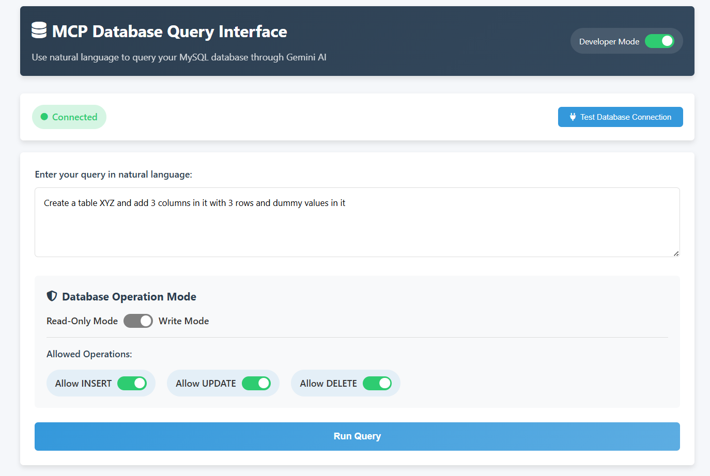
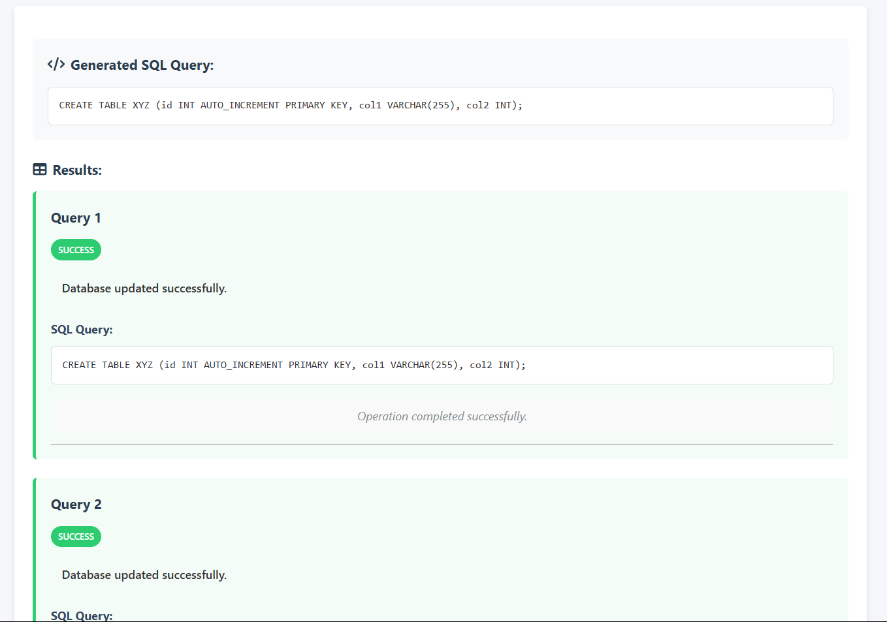
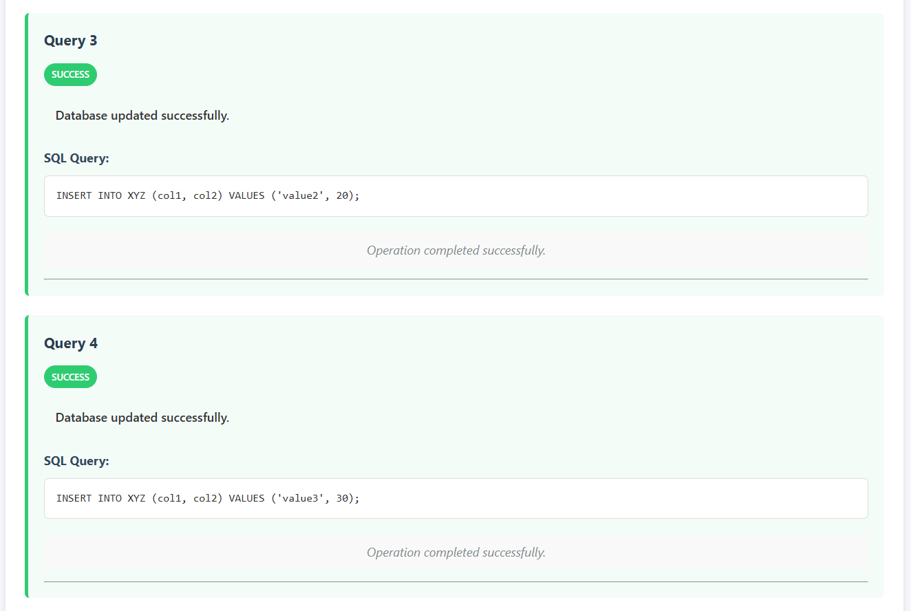
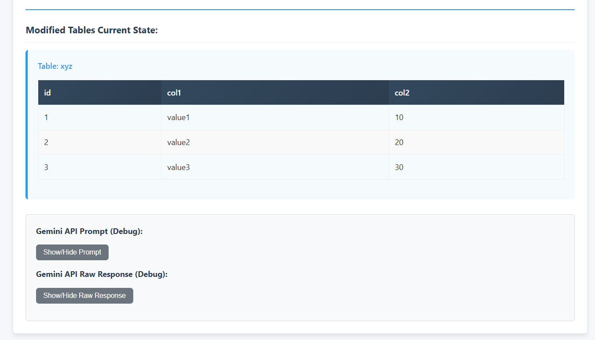

# MCP Server with MySQL and Gemini API Integration

An interactive natural language to SQL query application that uses the Model Context Protocol (MCP) server to connect MySQL with the Gemini API. This application allows users to interact with a MySQL database using natural language queries.
# Application Overview


# Query From the AI


# Query Executed Successfully


# Developer Options

## Features

- **Natural Language Interface**: Query your database using plain English
- **Dynamic SQL Generation**: Converts natural language to SQL using Google's Gemini API
- **Multiple Query Support**: Execute multiple SQL operations from a single prompt
- **Database Schema Inspection**: Dynamically adapts to your database structure
- **Read/Write Mode Toggle**: Control which operations are allowed
- **Granular Permissions**: Enable/disable specific operations (INSERT, UPDATE, DELETE)
- **Live Table Updates**: View table contents after modifications
- **Detailed Error Handling**: Clear categorization of error types

## Setup Instructions

### Prerequisites

- Node.js (v14+)
- MySQL Server
- API key for Google's Gemini API

### Installation

1. Clone this repository
2. Set up environment variables:
   - Copy the `.env` file to the `backend` directory
   - Ensure your MySQL credentials and Gemini API key are correct

```
GEMINI_API_KEY=your_gemini_api_key
DB_HOST=localhost
DB_PORT=3306
DB_USER=your_mysql_username
DB_PASSWORD=your_mysql_password
DB_NAME=mcp_database
PORT=3000
```

3. Install dependencies and start the server:

```
cd .\frontend\
python -m http.server

cd .\backend\
node .\src\index.js
```

4. Open the frontend:
   - Simply open `frontend/index.html` in your browser
   - Alternatively, use a local HTTP server to serve the frontend

### Running the Application

#### Running the Frontend

Navigate to the frontend directory and start a simple HTTP server:

```bash
cd frontend
python -m http.server
```

This will serve the frontend application on http://localhost:8000 by default.

#### Running the Backend

Navigate to the backend directory and start the Node.js server:

```bash
cd backend
node src/index.js
```

This will start the backend server according to the port specified in your environment variables (default: 3000).

### Database Setup

You can import the sample database structure using the provided SQL file:

```
mysql -u your_username -p < database-sample.sql
```

This creates a sample database with users, products, orders, and related tables for demonstration.

## Usage

1. **Connect to Database**: Click "Test Database Connection" first
2. **Enter Natural Language Query**: Type your request in plain English
3. **Set Operation Permissions**:
   - Keep "Read-Only Mode" (default) for SELECT queries only
   - Enable "Write Mode" and check specific permissions to allow modifications
4. **Run Query**: Click the button to execute
5. **View Results**:
   - See generated SQL queries and their results
   - For data modification operations, view the current state of modified tables


## Example Queries

### Read-Only Examples:

- "Show me all users over 30"
- "List products in the Electronics category"
- "What's the total value of all pending orders?"
- "Find the most expensive product"


### Write Mode Examples:

- "Add a new product named Gaming Mouse with price $59.99 in Electronics category with 45 in stock"
- "Update the price of the Laptop to $1199.99"
- "Delete all products with zero stock"
- "Create a new table called employees with columns for id, name, position, and salary"

## Advanced Features

### Multiple Operations

The application now supports executing multiple SQL operations from a single prompt. For example:

```
Create a new table called employees with columns for id, name, position, and salary,
then add three employees: John (Manager, $5000), Mary (Developer, $4500), and Bob (Designer, $4000).
```


### Modified Tables Display

After any data modification (INSERT, UPDATE, DELETE), the application automatically shows the current state of the modified tables so you can verify the changes.

### Detailed Error Messages

Errors are now clearly categorized as:

- `VALIDATION ERROR`: Issues with SQL syntax or invalid operations
- `PERMISSION ERROR`: Operations not allowed by current settings
- `EXECUTION ERROR`: Database errors during query execution
- `SERVER ERROR`: Backend processing failures

## Architecture

- **Frontend**: HTML, CSS, and JavaScript (no frameworks)
- **Backend**: Node.js with Express
- **Database**: MySQL
- **AI Integration**: Google's Gemini API

## Security Considerations

- The application validates all SQL queries before execution
- Only explicitly permitted operations are allowed
- Environment variables protect sensitive credentials
- Basic SQL injection prevention measures are implemented

---
